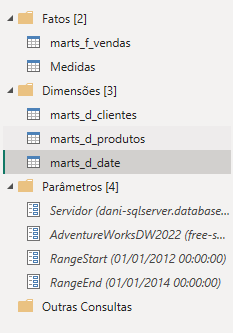
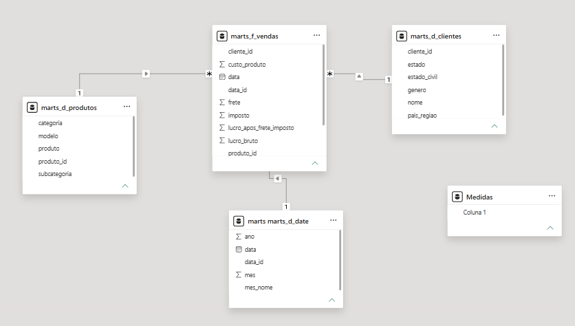

# Boas Práticas:

## 🗂️ Estrutura do Dashboard

Boas práticas foram aplicadas em todas as etapas de construção do dashboard, incluindo a preparação e organização dos dados no Power Query, a modelagem dimensional seguindo o esquema estrela, a criação de métricas em DAX e a implementação de recursos de interatividade. A estrutura do projeto também foi organizada para facilitar a manutenção, reutilização e escalabilidade da solução.

## 1. Organização no Power Query

Os processos de transformação foram organizados em pastas, separando tabelas de dimensão e fato. Foram criados parâmetros para centralizar as informações de conexão, como caminho do servidor e nome do banco de dados. Essa abordagem evita valores fixos nas consultas e facilita futuras alterações no ambiente de dados. Também foram utilizados os parâmetros RangeStart e RangeEnd, seguindo as boas práticas para definição de períodos e preparação do modelo para recursos como atualização incremental no Power BI.

## 2. Modelagem Dimensional

O modelo de dados foi estruturado seguindo o esquema estrela, separando a tabela fato das tabelas dimensão e estabelecendo relacionamentos adequados entre elas. Essa abordagem contribui para uma modelagem mais organizada, melhor desempenho e maior facilidade na criação de análises e métricas.

## 3. Interatividade e Experiência do Usuário

Foram implementados recursos de interatividade para permitir a exploração dos dados de forma dinâmica, utilizando filtros, segmentações e interações entre os visuais. Dessa forma, o usuário pode analisar os indicadores sob diferentes perspectivas e períodos.

# 🚀 Resultado:

Ao final do projeto, o dashboard deverá fornecer uma visão completa do desempenho financeiro e comercial da base **AdventureWorksDW2022**, permitindo análises desde uma visão executiva de alto nível até o detalhamento por produto, categoria, cliente e região.

A solução demonstra, na prática, o fluxo completo de um projeto de dados:

> **Migração → Transformação → Modelagem → Análise → Visualização → Geração de Insights**

Com isso, o projeto consolida conhecimentos em:

* ☁️ Azure SQL
* 🗄️ SQL Server
* 🔄 ETL e Transformação de Dados
* 🧹 Power Query
* 📊 Modelagem Dimensional
* 🧮 DAX
* 📈 Power BI
* 🧑‍💻 Git e GitHub
* 📚 Documentação Técnica

---

- [Insights](/data_visualization/docs/insights.md)
- [Perguntas de Negócios](/data_visualization/docs/perguntas_negocios.md)
- [Volte ao README.md do Power BI](/data_visualization/powerbi/README.md)
- [Publicação do relatório](https://app.powerbi.com/view?r=eyJrIjoiZmFiMWE4YWItNmM5Yi00ZDE3LWEzYWUtYzlmYmJlYjAwZGNiIiwidCI6ImVkNTJhZDViLTU0YzktNDNlZi04YmNhLThlOWY4Y2U0Zjc1ZiJ9)
- [Data-Visualization #2](/data_visualization/README.md)
- [Data-Visualization #1](/README.md)

